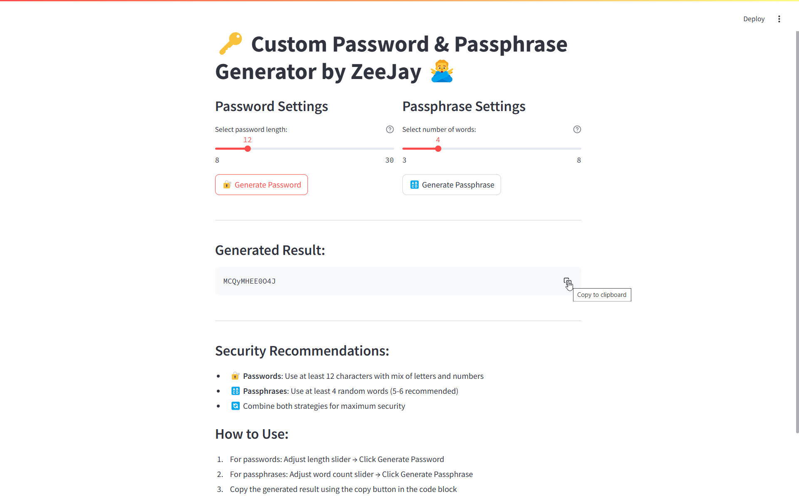
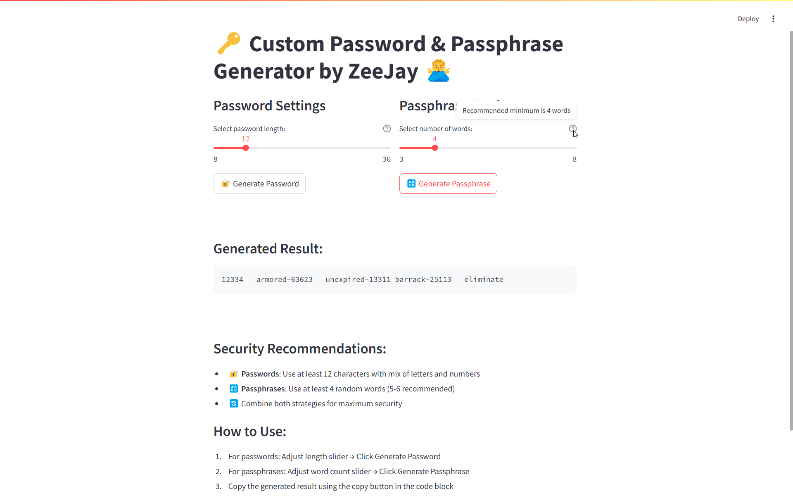

# 🔑 Custom Password & Passphrase Generator

## 🚀 Live Demo
[[Live Link](https://password-generator-zeejay.streamlit.app/)]

## 📜 About the Project
This is a **secure, easy-to-use password & passphrase generator** built using **Streamlit**. It allows users to:

✅ Generate **random secure passwords** with adjustable lengths.

✅ Generate **passphrases** using a local word list.

✅ Easily **copy & use** generated results.

✅ Get **security tips** for better password management.

---

## 🔧 Installation & Usage

1. **Clone the repository:**
```bash
git clone https://github.com/zohaib-javd/password-generator.git
cd password-generator
```
2. **Install dependencies:**
```bash
pip install -r requirements.txt
```
3. **Run the Streamlit app:**
```bash
streamlit run app.py
```
---
## 📸 App Preview


---

## 📌 Features

- **🔐 Password Generator:**
  - Adjustable password length (8-30 characters)
  - Uses a mix of letters & numbers for strong security
- **🔠 Passphrase Generator:**
  - Select number of words (3-8)
  - Generates easy-to-remember but secure phrases
  - Uses a local word list (ensure `words.txt` is present)
- **💡 Security Recommendations:**
  - Tips for password & passphrase best practices
  - Encourages strong authentication habits
- **📱 User-Friendly Interface:**
  - Streamlit-powered interactive UI
  - Simple & fast one-click generation

---

## 🔗 Connect with Me
- **LinkedIn:** [linkedin.com/in/zohaib-javd](https://linkedin.com/in/zohaib-javd)
- **GitHub:** [github.com/zohaib-javd](https://github.com/zohaib-javd)
- **Email:** [zohaibjaved@gmail.com](mailto:zohaibjaved@gmail.com)

---

## 🎯 Future Enhancements
📌 Add an **option for special characters** in passwords  
📌 Allow **custom separators** for passphrases  
📌 Add a **dark mode** for better user experience  

---

## 📜 License
This project is licensed under the MIT License - see the [LICENSE](LICENSE) file for details.

---

### ⭐ If you found this useful, don't forget to **star** the repository!
